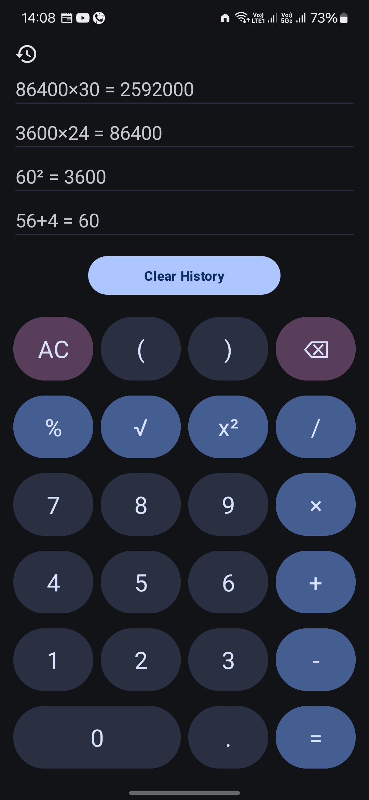

# Calculator


A comprehensive scientific calculator Android application with a user-friendly interface and advanced mathematical functions. Also my second project after Splash Wallpaper, revamped completely.

## 🌟Features

- Basic arithmetic operations (+, -, ×, ÷)
- Advanced mathematical functions (sin, cos, tan, log, ln, √, ^)
- Trigonometric functions in both radians and degrees
- Inverse trigonometric functions (asin, acos, atan)
- Constants (π, e)
- Percentage calculations
- Parentheses for complex expressions
- Factorial calculations
- Real-time expression evaluation
- Landscape mode for additional functions
- Calculation history with clear button
- Dynamic Colors
- App Updater

## 📱Screenshots

|  |  |  |

## 🚀Release


[](https://github.com/Debojit-mitra/Calculator/releases/latest)

# 🛠️Technologies Used

- Java
- Android Studio

## Getting Started

### Prerequisites

- Android Studio
- Android SDK

## 🔧Installation

To get a local copy up and running follow these simple steps:

1. **Clone the repo**

   ```sh
   git clone https://github.com/Debojit-mitra/Calculator.git
   ```

2. **Open with Android Studio**
   - Import the project in Android Studio.
3. **Build and Run**
   - Sync the project with Gradle files and run it on an Android device or emulator.

## 🤝Contributing
### Contributions are welcome! Please feel free to submit a Pull Request.
- Fork the Project
- Create your Feature Branch (`git checkout -b feature/YourFeatureName`)
- Commit your Changes (`git commit -m 'Add some feature'`)
- Push to the Branch (`git push origin feature/YourFeatureName`)
- Open a Pull Request
### Issues
- If you find any issues or have suggestions, please report them via the [Issues](https://github.com/Debojit-mitra/Calculator/issues) section on GitHub.